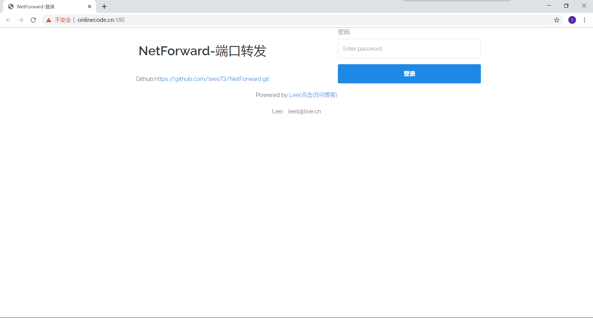
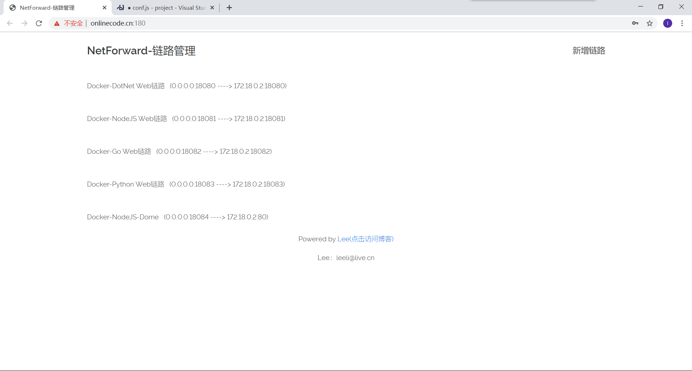
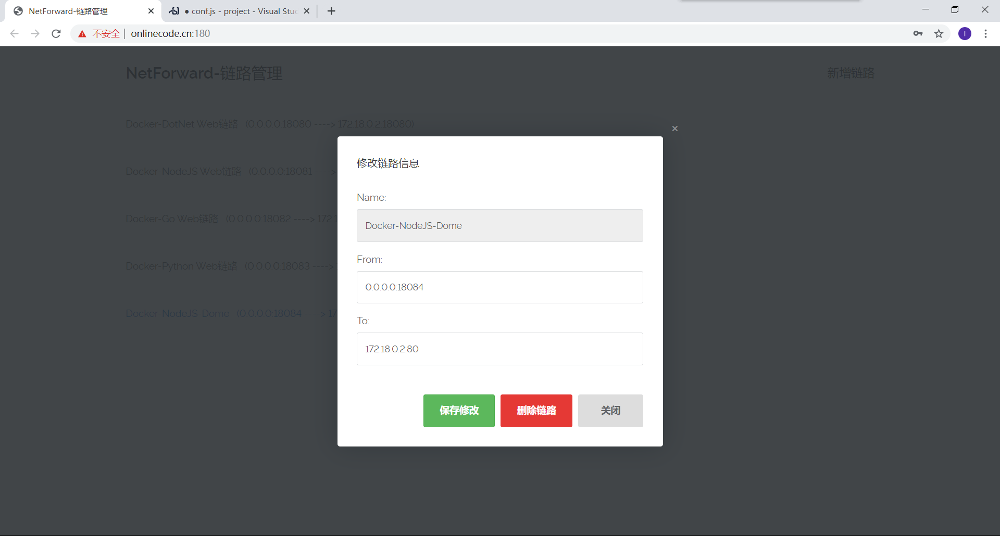
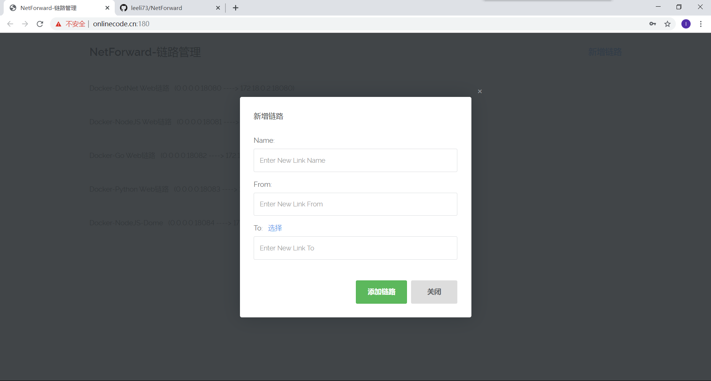

NetForward
============

NetForward是为了方便我自己在服务器使用code-server进行Web开发而编写的程序。

主要用于快速把服务器公网的某个端口转发至Docker。

该程序由本人抽时间快速完成的，所以在代码风格和可读性方面可能极差，请谅解。

上面是预览效果，包括登录界面、链路管理界面、修改、删除和新增。

目前已经完成
============

链路的保存、修改、删除、新增等功能

未来
====

修复获取Docker IP失败的问题

修复修改链路信息后，部分资源无法释放的问题

部署编译
========

准备
----

git clone <https://github.com/leeli73/NetForward.git>

vi conf/conf.json

vi conf/data.data

编译
----

cd NetForward

go build main.go

chmod +x main

./main

